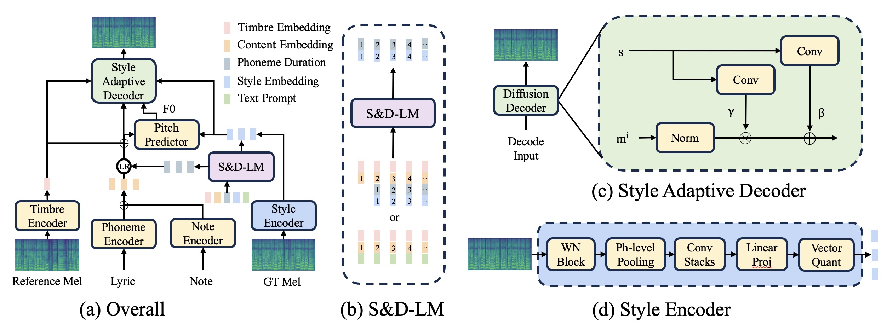

{:.no_toc}
* toc
{:toc}

# Abstract

Zero-shot singing voice synthesis (SVS) with style transfer and style control aims to generate high-quality singing voices with unseen timbres and styles (including singing method, emotion, rhythm, techniques, and pronunciation) from audio and text prompts. 
However, the multifaceted nature of singing voice styles poses a significant challenge for comprehensive modeling and effective transfer and control. 
Furthermore, existing SVS models often fail to generate singing voices with a wealth of stylistic nuances for unseen singers. 
In this paper, we introduce TCSinger, a novel zero-shot SVS model that primarily employs three modules to address these challenges: 
1) the clustering style encoder that employs a clustering vector quantization (CVQ) model to condense style information into a compact latent space, thus facilitating subsequent predictions;
2) the Style and Duration Language Model (S\&D-LM), which concurrently predicts style information and phoneme duration, thereby enhancing both, and the S\&D-LM uses audio and text prompts to conduct both style transfer and style control;
and 3) the style adaptive decoder using a novel mel-style adaptive normalization method to generate singing voices with enhanced details.
Experimental results show that TCSinger outperforms baseline models in synthesis quality, 
singer similarity, and style controllability across various tasks, including zero-shot style transfer, multi-level style control, cross-lingual style transfer, and speech-to-singing style transfer.



---

**Note：** The audio on this GitHub page may load slowly and could pause momentarily at around the 2-second mark.Thank you for your patience.

---

# Zero-Shot Style Transfer

To assess the performance of TCSinger and baseline models in the zero-shot style transfer task, we randomly select singing voices with unseen singers from the test set as target samples and different utterances from the same singers to form prompt samples.

1.Target Word: 又 站 在 你 家 的 门 口 我 们 重 复 沉 默

Prompt: 终 于 你 开 口 向 我 诉 说 她 有 多 温 柔

Successfully transferring the timbre, resonance in pop singing method, mixed voice technique, pronunciation, rhythm, and pitch transition style.

<table style='width: 40%;'>
	<thead>
		<tr>
			<th style="text-align: center">Prompt</th>
			<th style="text-align: center">Ground Truth</th>
		</tr>
	</thead>
	<tbody>
		<tr>
			<td style="text-align: center"><audio controls style="width: 150px;"><source src="wavs/svs/prompt/001.wav" type="audio/wav"></audio></td>
			<td style="text-align: center"><audio controls style="width: 150px;"><source src="wavs/svs/gt/001.wav" type="audio/wav"></audio></td>
		</tr>
	</tbody>
</table>

<table style='width: 100%;'>
	<thead>
		<tr>
      		<th style="text-align: center">YourTTS</th>
			<th style="text-align: center">Mega-TTS</th>
			<th style="text-align: center">RMSSinger</th>
			<th style="text-align: center">StyleSinger</th>
			<th style="text-align: center">TCSinger</th>
		</tr>
	</thead>
	<tbody>
		<tr>
      			<td style="text-align: center"><audio controls style="width: 150px;"><source src="wavs/svs/yourtts/001.wav" type="audio/wav"></audio></td>
				<td style="text-align: center"><audio controls style="width: 150px;"><source src="wavs/svs/mega/001.wav" type="audio/wav"></audio></td>
      			<td style="text-align: center"><audio controls style="width: 150px;"><source src="wavs/svs/rms/001.wav" type="audio/wav"></audio></td>
				<td style="text-align: center"><audio controls style="width: 150px;"><source src="wavs/svs/style/001.wav" type="audio/wav"></audio></td>
				<td style="text-align: center"><audio controls style="width: 150px;"><source src="wavs/svs/tc/001.wav" type="audio/wav"></audio></td>
		</tr>
	</tbody>
</table>

2.Target Word: 我 听 见 雨 滴 落 在 青 青 草 地 SP 我 听 见 远 方 下 课 钟 声 响 起

Prompt: 可 是 我 没 有 听 见 你 的 声 音 SP 认 真 呼 唤 我 姓 名

Successfully transferring the timbre, pronunciation, pitch transition style, and rhythm.

<table style='width: 40%;'>
	<thead>
		<tr>
			<th style="text-align: center">Prompt</th>
			<th style="text-align: center">Ground Truth</th>
		</tr>
	</thead>
	<tbody>
		<tr>
			<td style="text-align: center"><audio controls style="width: 150px;"><source src="wavs/svs/prompt/002.wav" type="audio/wav"></audio></td>
			<td style="text-align: center"><audio controls style="width: 150px;"><source src="wavs/svs/gt/002.wav" type="audio/wav"></audio></td>
		</tr>
	</tbody>
</table>

<table style='width: 100%;'>
	<thead>
		<tr>
      		<th style="text-align: center">YourTTS</th>
			<th style="text-align: center">Mega-TTS</th>
			<th style="text-align: center">RMSSinger</th>
			<th style="text-align: center">StyleSinger</th>
			<th style="text-align: center">TCSinger</th>
		</tr>
	</thead>
	<tbody>
		<tr>
      			<td style="text-align: center"><audio controls style="width: 150px;"><source src="wavs/svs/yourtts/002.wav" type="audio/wav"></audio></td>
				<td style="text-align: center"><audio controls style="width: 150px;"><source src="wavs/svs/mega/002.wav" type="audio/wav"></audio></td>
      			<td style="text-align: center"><audio controls style="width: 150px;"><source src="wavs/svs/rms/002.wav" type="audio/wav"></audio></td>
				<td style="text-align: center"><audio controls style="width: 150px;"><source src="wavs/svs/style/002.wav" type="audio/wav"></audio></td>
				<td style="text-align: center"><audio controls style="width: 150px;"><source src="wavs/svs/tc/002.wav" type="audio/wav"></audio></td>
		</tr>
	</tbody>
</table>

3.Target Word: 也 不 是 真 的 AP 不 会 想 你 AP 全 都 不 是 真 的 AP 是 骗 自 己

Prompt: 让 我 这 样 吧 SP 并 不 是 真 的 AP 路 过 而 已

Successfully transferring the timbre, pronunciation, pitch transition style, and rhythm.

<table style='width: 40%;'>
	<thead>
		<tr>
			<th style="text-align: center">Prompt</th>
			<th style="text-align: center">Ground Truth</th>
		</tr>
	</thead>
	<tbody>
		<tr>
			<td style="text-align: center"><audio controls style="width: 150px;"><source src="wavs/svs/prompt/003.wav" type="audio/wav"></audio></td>
			<td style="text-align: center"><audio controls style="width: 150px;"><source src="wavs/svs/gt/003.wav" type="audio/wav"></audio></td>
		</tr>
	</tbody>
</table>

<table style='width: 100%;'>
	<thead>
		<tr>
      		<th style="text-align: center">YourTTS</th>
			<th style="text-align: center">Mega-TTS</th>
			<th style="text-align: center">RMSSinger</th>
			<th style="text-align: center">StyleSinger</th>
			<th style="text-align: center">TCSinger</th>
		</tr>
	</thead>
	<tbody>
		<tr>
      			<td style="text-align: center"><audio controls style="width: 150px;"><source src="wavs/svs/yourtts/003.wav" type="audio/wav"></audio></td>
				<td style="text-align: center"><audio controls style="width: 150px;"><source src="wavs/svs/mega/003.wav" type="audio/wav"></audio></td>
      			<td style="text-align: center"><audio controls style="width: 150px;"><source src="wavs/svs/rms/003.wav" type="audio/wav"></audio></td>
				<td style="text-align: center"><audio controls style="width: 150px;"><source src="wavs/svs/style/003.wav" type="audio/wav"></audio></td>
				<td style="text-align: center"><audio controls style="width: 150px;"><source src="wavs/svs/tc/003.wav" type="audio/wav"></audio></td>
		</tr>
	</tbody>
</table>

4.Target Word: 谁 娶 了 多 愁 善 感 的 你

Prompt: 谁 把 你 的 长 发 盘 起

Successfully transferring the timbre, pronunciation, pitch transition style, and rhythm.

<table style='width: 40%;'>
	<thead>
		<tr>
			<th style="text-align: center">Prompt</th>
			<th style="text-align: center">Ground Truth</th>
		</tr>
	</thead>
	<tbody>
		<tr>
			<td style="text-align: center"><audio controls style="width: 150px;"><source src="wavs/svs/prompt/004.wav" type="audio/wav"></audio></td>
			<td style="text-align: center"><audio controls style="width: 150px;"><source src="wavs/svs/gt/004.wav" type="audio/wav"></audio></td>
		</tr>
	</tbody>
</table>

<table style='width: 100%;'>
	<thead>
		<tr>
      		<th style="text-align: center">YourTTS</th>
			<th style="text-align: center">Mega-TTS</th>
			<th style="text-align: center">RMSSinger</th>
			<th style="text-align: center">StyleSinger</th>
			<th style="text-align: center">TCSinger</th>
		</tr>
	</thead>
	<tbody>
		<tr>
      			<td style="text-align: center"><audio controls style="width: 150px;"><source src="wavs/svs/yourtts/004.wav" type="audio/wav"></audio></td>
				<td style="text-align: center"><audio controls style="width: 150px;"><source src="wavs/svs/mega/004.wav" type="audio/wav"></audio></td>
      			<td style="text-align: center"><audio controls style="width: 150px;"><source src="wavs/svs/rms/004.wav" type="audio/wav"></audio></td>
				<td style="text-align: center"><audio controls style="width: 150px;"><source src="wavs/svs/style/004.wav" type="audio/wav"></audio></td>
				<td style="text-align: center"><audio controls style="width: 150px;"><source src="wavs/svs/tc/004.wav" type="audio/wav"></audio></td>
		</tr>
	</tbody>
</table>

5.Target Word: settled down that you AP found a girl and you AP

Prompt: I head AP that you are AP

Successfully transferring the timbre, pronunciation, pitch transition style, rhythm, and glissando technique.

<table style='width: 40%;'>
	<thead>
		<tr>
			<th style="text-align: center">Prompt</th>
			<th style="text-align: center">Ground Truth</th>
		</tr>
	</thead>
	<tbody>
		<tr>
			<td style="text-align: center"><audio controls style="width: 150px;"><source src="wavs/svs/prompt/005.wav" type="audio/wav"></audio></td>
			<td style="text-align: center"><audio controls style="width: 150px;"><source src="wavs/svs/gt/005.wav" type="audio/wav"></audio></td>
		</tr>
	</tbody>
</table>

<table style='width: 100%;'>
	<thead>
		<tr>
      		<th style="text-align: center">YourTTS</th>
			<th style="text-align: center">Mega-TTS</th>
			<th style="text-align: center">RMSSinger</th>
			<th style="text-align: center">StyleSinger</th>
			<th style="text-align: center">TCSinger</th>
		</tr>
	</thead>
	<tbody>
		<tr>
      			<td style="text-align: center"><audio controls style="width: 150px;"><source src="wavs/svs/yourtts/005.wav" type="audio/wav"></audio></td>
				<td style="text-align: center"><audio controls style="width: 150px;"><source src="wavs/svs/mega/005.wav" type="audio/wav"></audio></td>
      			<td style="text-align: center"><audio controls style="width: 150px;"><source src="wavs/svs/rms/005.wav" type="audio/wav"></audio></td>
				<td style="text-align: center"><audio controls style="width: 150px;"><source src="wavs/svs/style/005.wav" type="audio/wav"></audio></td>
				<td style="text-align: center"><audio controls style="width: 150px;"><source src="wavs/svs/tc/005.wav" type="audio/wav"></audio></td>
		</tr>
	</tbody>
</table>

6.Target Word: you belong with me belong with me

Prompt: standing by and waiting at your back door SP all this time how could you not know baby
Successfully transferring the timbre, pronunciation, pitch transition style, rhythm, and vibrato technique.

<table style='width: 40%;'>
	<thead>
		<tr>
			<th style="text-align: center">Prompt</th>
			<th style="text-align: center">Ground Truth</th>
		</tr>
	</thead>
	<tbody>
		<tr>
			<td style="text-align: center"><audio controls style="width: 150px;"><source src="wavs/svs/prompt/006.wav" type="audio/wav"></audio></td>
			<td style="text-align: center"><audio controls style="width: 150px;"><source src="wavs/svs/gt/006.wav" type="audio/wav"></audio></td>
		</tr>
	</tbody>
</table>

<table style='width: 100%;'>
	<thead>
		<tr>
      		<th style="text-align: center">YourTTS</th>
			<th style="text-align: center">Mega-TTS</th>
			<th style="text-align: center">RMSSinger</th>
			<th style="text-align: center">StyleSinger</th>
			<th style="text-align: center">TCSinger</th>
		</tr>
	</thead>
	<tbody>
		<tr>
      			<td style="text-align: center"><audio controls style="width: 150px;"><source src="wavs/svs/yourtts/006.wav" type="audio/wav"></audio></td>
				<td style="text-align: center"><audio controls style="width: 150px;"><source src="wavs/svs/mega/006.wav" type="audio/wav"></audio></td>
      			<td style="text-align: center"><audio controls style="width: 150px;"><source src="wavs/svs/rms/006.wav" type="audio/wav"></audio></td>
				<td style="text-align: center"><audio controls style="width: 150px;"><source src="wavs/svs/style/006.wav" type="audio/wav"></audio></td>
				<td style="text-align: center"><audio controls style="width: 150px;"><source src="wavs/svs/tc/006.wav" type="audio/wav"></audio></td>
		</tr>
	</tbody>
</table>

---

# Multi-Level Style Control

## Parallel Style Control

In the parallel experiments, we use the GT global style and phoneme-level techniques as the target. 

1.Target Word: 你 是 魔 鬼 中 的 天 使 所 以 送 我 心 碎 的 方 式 AP 是 让 我 笑 到 最 后 AP

Global Text Prompt (Singing Method and Emotion): bel canto, sad

Phoneme-Level Text Prompt (Technique Sequence): 
```
['AP(0)', 'n(1)', 'i(1)', 'sh(1)', 'i(1)', 'm(1)', 'o(1)', 'g(1)', 'uei(1)', 'zh(1)', 'ong(1)', 'd(1)', 'e(6)', 't(1)', 'ian(1)', 'sh(1)', 'i(1)', 's(1,6)', 'uo(1,6)', 'i(1)', 's(1)', 'ong(1)', 'uo(1)', 'x(1)', 'in(1)', 's(1)', 'uei(1)', 'd(1)', 'e(1)', 'f(1)', 'ang(1)', 'sh(1)', 'i(1)', 'AP(0)', 'sh(1)', 'i(1)', 'r(1)', 'ang(1)', 'uo(1)', 'x(1)', 'iao(1)', 'd(1)', 'ao(1)', 'z(1)', 'uei(1)', 'h(1)', 'ou(1)', 'AP(0)']
```

(0: no technique, 1: mix, 2: falsetto, 3: breathy, 4: pharyngeal, 5: vibrato, 6: glissando)

Successfully control global singing method and emotion, and the phoneme-level techniques of glissando and mixed voice.

<table style='width: 20%;'>
	<thead>
		<tr>
      		<th style="text-align: center">Ground Truth</th>
		</tr>
	</thead>
	<tbody>
		<tr>
      			<td style="text-align: center"><audio controls style="width: 150px;"><source src="wavs/text/gt/001.wav" type="audio/wav"></audio></td>
		</tr>
	</tbody>
</table>

<table style='width: 100%;'>
	<thead>
		<tr>
      		<th style="text-align: center">YourTTS</th>
			<th style="text-align: center">Mega-TTS</th>
			<th style="text-align: center">RMSSinger</th>
			<th style="text-align: center">StyleSinger</th>
			<th style="text-align: center">TCSinger</th>
		</tr>
	</thead>
	<tbody>
		<tr>
      			<td style="text-align: center"><audio controls style="width: 150px;"><source src="wavs/text/yourtts/001.wav" type="audio/wav"></audio></td>
				<td style="text-align: center"><audio controls style="width: 150px;"><source src="wavs/text/mega/001.wav" type="audio/wav"></audio></td>
      			<td style="text-align: center"><audio controls style="width: 150px;"><source src="wavs/text/rms/001.wav" type="audio/wav"></audio></td>
				<td style="text-align: center"><audio controls style="width: 150px;"><source src="wavs/text/style/001.wav" type="audio/wav"></audio></td>
				<td style="text-align: center"><audio controls style="width: 150px;"><source src="wavs/text/tc/001.wav" type="audio/wav"></audio></td>
		</tr>
	</tbody>
</table>

2.Target Word: 宁 愿 选 择 留 恋 不 放 手 AP 等 到 风 景 都 看 透 AP 也 许 你 会 陪 我 看 细 水 AP 长 流

Global Text Prompt (Singing Method and Emotion): pop, sad

Phoneme-Level Text Prompt (Technique Sequence): 
```
['n(1)', 'ing(1)', 'van(1)', 'x(1)', 'van(1)', 'z(1)', 'e(1)', 'l(2)', 'iou(2)', 'l(2)', 'ian(2)', 'b(2)', 'u(2)', 'f(2)', 'ang(2)', 'sh(2)', 'ou(2)','AP(0)' 'd(2)', 'eng(2)', 'd(2)', 'ao(2)', 'f(2)', 'eng(2)', 'j(2)', 'ing(2)', 'd(2)', 'ou(2)', 'k(2)', 'an(2)', 't(2)', 'ou(2)','AP(0)', 'ie(2)', 'x(2)', 'v(2)', 'n(12', 'i(2)', 'h(2)', 'uei(2)', 'p(2)', 'ei(2)', 'uo(2)', 'k(2)', 'an(2)', 'x(1)', 'i(1)', 'sh(1)', 'uei(1)', 'AP(0)','ch(1)', 'ang(1)', 'l(1)', 'iou(1)']
```

(0: no technique, 1: mix, 2: falsetto, 3: breathy, 4: pharyngeal, 5: vibrato, 6: glissando)

Successfully control global singing method and emotion, and the phoneme-level techniques of falsetto and mixed voice.

<table style='width: 20%;'>
	<thead>
		<tr>
      		<th style="text-align: center">Ground Truth</th>
		</tr>
	</thead>
	<tbody>
		<tr>
      			<td style="text-align: center"><audio controls style="width: 150px;"><source src="wavs/text/gt/002.wav" type="audio/wav"></audio></td>
		</tr>
	</tbody>
</table>

<table style='width: 100%;'>
	<thead>
		<tr>
      		<th style="text-align: center">YourTTS</th>
			<th style="text-align: center">Mega-TTS</th>
			<th style="text-align: center">RMSSinger</th>
			<th style="text-align: center">StyleSinger</th>
			<th style="text-align: center">TCSinger</th>
		</tr>
	</thead>
	<tbody>
		<tr>
      			<td style="text-align: center"><audio controls style="width: 150px;"><source src="wavs/text/yourtts/002.wav" type="audio/wav"></audio></td>
				<td style="text-align: center"><audio controls style="width: 150px;"><source src="wavs/text/mega/002.wav" type="audio/wav"></audio></td>
      			<td style="text-align: center"><audio controls style="width: 150px;"><source src="wavs/text/rms/002.wav" type="audio/wav"></audio></td>
				<td style="text-align: center"><audio controls style="width: 150px;"><source src="wavs/text/style/002.wav" type="audio/wav"></audio></td>
				<td style="text-align: center"><audio controls style="width: 150px;"><source src="wavs/text/tc/002.wav" type="audio/wav"></audio></td>
		</tr>
	</tbody>
</table>

## Non-Parallel Style Control

In the non-parallel experiments, global styles and six techniques are randomly yet appropriately assigned.

1.Target Word: remember us this way way AP
Global Text Prompt (Singing Method and Emotion): pop, sad

Phoneme-Level Text Prompt (Technique Sequence): 
```
['R(1)', 'IH0(1)', 'M(1)', 'EH1(1)', 'M(1)', 'B(1)', 'ER0(1)', 'AH1(1,5,6)', 'S(1,5,6)', 'DH(1)', 'IH1(1)', 'S(1)', 'W(1,6)', 'EY1(2,6)', 'W(2)', 'EY1(2)', 'AP(0)']
```

(0: no technique, 1: mix, 2: falsetto, 3: breathy, 4: pharyngeal, 5: vibrato, 6: glissando)

Successfully control global singing method and emotion, and the phoneme-level techniques of vibrato, glissando, falsetto, and mixed voice.

<table style='width: 100%;'>
	<thead>
		<tr>
      		<th style="text-align: center">YourTTS</th>
			<th style="text-align: center">Mega-TTS</th>
			<th style="text-align: center">RMSSinger</th>
			<th style="text-align: center">StyleSinger</th>
			<th style="text-align: center">TCSinger</th>
		</tr>
	</thead>
	<tbody>
		<tr>
      			<td style="text-align: center"><audio controls style="width: 150px;"><source src="wavs/text/yourtts/003.wav" type="audio/wav"></audio></td>
				<td style="text-align: center"><audio controls style="width: 150px;"><source src="wavs/text/mega/003.wav" type="audio/wav"></audio></td>
      			<td style="text-align: center"><audio controls style="width: 150px;"><source src="wavs/text/rms/003.wav" type="audio/wav"></audio></td>
				<td style="text-align: center"><audio controls style="width: 150px;"><source src="wavs/text/style/003.wav" type="audio/wav"></audio></td>
				<td style="text-align: center"><audio controls style="width: 150px;"><source src="wavs/text/tc/003.wav" type="audio/wav"></audio></td>
		</tr>
	</tbody>
</table>

2.Target Word: SP I remember tears streaming down your face when I sad I'll never let you go AP

Global Text Prompt (Singing Method and Emotion): pop, sad

Phoneme-Level Text Prompt (Technique Sequence): 
```
[['SP(0)', 'AY1(2)', 'R(2)', 'IH0(2)', 'M(2)', 'EH1(2)', 'M(2)', 'B(2)', 'ER0(2)', 'T(2)', 'IH1(2)', 'R(2)', 'Z(2)', 'S(2)', 'T(2)', 'R(2)', 'IY1(2)', 'M(2)', 'IH0(2)', 'NG(2)', 'D(2)', 'AW1(2)', 'N(2)', 'Y(2)', 'UH1(2)', 'R(2)', 'F(2)', 'EY1(2)', 'S(2)', 'HH(1)', 'W(1)', 'EH1(1)', 'N(1)', 'AY1(1)', 'S(1)', 'EH1(1)', 'D(1)', 'AY1(1)', 'L(1)', 'N(1)', 'EH1(1)', 'V(1)', 'ER0(1)', 'L(1)', 'EH1(1)', 'T(1)', 'Y(1)', 'UW1(1)', 'G(1)', 'OW1(1)', 'AP(0)']
```

(0: no technique, 1: mix, 2: falsetto, 3: breathy, 4: pharyngeal, 5: vibrato, 6: glissando)

Successfully control global singing method and emotion, and the phoneme-level techniques of vibrato, falsetto, and mixed voice.

<table style='width: 100%;'>
	<thead>
		<tr>
      		<th style="text-align: center">YourTTS</th>
			<th style="text-align: center">Mega-TTS</th>
			<th style="text-align: center">RMSSinger</th>
			<th style="text-align: center">StyleSinger</th>
			<th style="text-align: center">TCSinger</th>
		</tr>
	</thead>
	<tbody>
		<tr>
      			<td style="text-align: center"><audio controls style="width: 150px;"><source src="wavs/text/yourtts/004.wav" type="audio/wav"></audio></td>
				<td style="text-align: center"><audio controls style="width: 150px;"><source src="wavs/text/mega/004.wav" type="audio/wav"></audio></td>
      			<td style="text-align: center"><audio controls style="width: 150px;"><source src="wavs/text/rms/004.wav" type="audio/wav"></audio></td>
				<td style="text-align: center"><audio controls style="width: 150px;"><source src="wavs/text/style/004.wav" type="audio/wav"></audio></td>
				<td style="text-align: center"><audio controls style="width: 150px;"><source src="wavs/text/tc/004.wav" type="audio/wav"></audio></td>
		</tr>
	</tbody>
</table>

---

# Cross-Lingual Style Transfer

To test the cross-lingual style transfer performance of various models, we alternately use unseen Chinese and English data as prompts and targets for inference, using MOS and SMOS as evaluation criteria.

1.Target Word: I love you baby SP trust in me when I say

Prompt: 让 我 掉 下 眼 泪 的 不 止 昨 夜 的 酒

Language: Chinese->English

Successfully transferring the timbre, the articulation method, pronunciation, pitch transition style, and rhythm.

<table style='width: 20%;'>
	<thead>
		<tr>
			<th style="text-align: center">Prompt</th>
		</tr>
	</thead>
	<tbody>
		<tr>
			<td style="text-align: center"><audio controls style="width: 150px;"><source src="wavs/cross/prompt/001.wav" type="audio/wav"></audio></td>
		</tr>
	</tbody>
</table>

<table style='width: 100%;'>
	<thead>
		<tr>
      		<th style="text-align: center">YourTTS</th>
			<th style="text-align: center">Mega-TTS</th>
			<th style="text-align: center">RMSSinger</th>
			<th style="text-align: center">StyleSinger</th>
			<th style="text-align: center">TCSinger</th>
		</tr>
	</thead>
	<tbody>
		<tr>
      			<td style="text-align: center"><audio controls style="width: 150px;"><source src="wavs/cross/yourtts/001.wav" type="audio/wav"></audio></td>
				<td style="text-align: center"><audio controls style="width: 150px;"><source src="wavs/cross/mega/001.wav" type="audio/wav"></audio></td>
      			<td style="text-align: center"><audio controls style="width: 150px;"><source src="wavs/cross/rms/001.wav" type="audio/wav"></audio></td>
				<td style="text-align: center"><audio controls style="width: 150px;"><source src="wavs/cross/style/001.wav" type="audio/wav"></audio></td>
				<td style="text-align: center"><audio controls style="width: 150px;"><source src="wavs/cross/tc/001.wav" type="audio/wav"></audio></td>
		</tr>
	</tbody>
</table>

2.Target Word: 情 丝 百 转 丝 丝 缠 乱 犹 不 知 

Prompt: They've all been said before you know so why don't we AP just play pretend AP

Language: English->Chinese

Successfully transferring the timbre, the articulation method, pronunciation, pitch transition style, and rhythm.

<table style='width: 20%;'>
	<thead>
		<tr>
			<th style="text-align: center">Prompt</th>
		</tr>
	</thead>
	<tbody>
		<tr>
			<td style="text-align: center"><audio controls style="width: 150px;"><source src="wavs/cross/prompt/002.wav" type="audio/wav"></audio></td>
		</tr>
	</tbody>
</table>

<table style='width: 100%;'>
	<thead>
		<tr>
      		<th style="text-align: center">YourTTS</th>
			<th style="text-align: center">Mega-TTS</th>
			<th style="text-align: center">RMSSinger</th>
			<th style="text-align: center">StyleSinger</th>
			<th style="text-align: center">TCSinger</th>
		</tr>
	</thead>
	<tbody>
		<tr>
      			<td style="text-align: center"><audio controls style="width: 150px;"><source src="wavs/cross/yourtts/002.wav" type="audio/wav"></audio></td>
				<td style="text-align: center"><audio controls style="width: 150px;"><source src="wavs/cross/mega/002.wav" type="audio/wav"></audio></td>
      			<td style="text-align: center"><audio controls style="width: 150px;"><source src="wavs/cross/rms/002.wav" type="audio/wav"></audio></td>
				<td style="text-align: center"><audio controls style="width: 150px;"><source src="wavs/cross/style/002.wav" type="audio/wav"></audio></td>
				<td style="text-align: center"><audio controls style="width: 150px;"><source src="wavs/cross/tc/002.wav" type="audio/wav"></audio></td>
		</tr>
	</tbody>
</table>

---

# Speech-to-Singing Style Transfer

## Parallel Speech-to-Singing Style Transfer

In parallel experiments, we randomly select samples with unseen singers from the test set as targets and different speech from the same singers to form prompts.

1.Target Word: You make me happy AP when skies are gray

Prompt: I belive that the heart does go on

Successfully transferring the timbre, pronunciation, pitch transition style, and rhythm.

<table style='width: 40%;'>
	<thead>
		<tr>
			<th style="text-align: center">Prompt</th>
			<th style="text-align: center">Groud Truth</th>
		</tr>
	</thead>
	<tbody>
		<tr>
			<td style="text-align: center"><audio controls style="width: 150px;"><source src="wavs/sts/prompt/001.wav" type="audio/wav"></audio></td>
			<td style="text-align: center"><audio controls style="width: 150px;"><source src="wavs/sts/gt/001.wav" type="audio/wav"></audio></td>
		</tr>
	</tbody>
</table>

<table style='width: 100%;'>
	<thead>
		<tr>
      		<th style="text-align: center">YourTTS</th>
			<th style="text-align: center">Mega-TTS</th>
			<th style="text-align: center">RMSSinger</th>
			<th style="text-align: center">StyleSinger</th>
			<th style="text-align: center">TCSinger</th>
		</tr>
	</thead>
	<tbody>
		<tr>
      			<td style="text-align: center"><audio controls style="width: 150px;"><source src="wavs/sts/yourtts/001.wav" type="audio/wav"></audio></td>
				<td style="text-align: center"><audio controls style="width: 150px;"><source src="wavs/sts/mega/001.wav" type="audio/wav"></audio></td>
      			<td style="text-align: center"><audio controls style="width: 150px;"><source src="wavs/sts/rms/001.wav" type="audio/wav"></audio></td>
				<td style="text-align: center"><audio controls style="width: 150px;"><source src="wavs/sts/style/001.wav" type="audio/wav"></audio></td>
				<td style="text-align: center"><audio controls style="width: 150px;"><source src="wavs/sts/tc/001.wav" type="audio/wav"></audio></td>
		</tr>
	</tbody>
</table>

2.Target Word: It can happen to anyone of us anyone you think of

Prompt: And you wonder SP I wonder how I wonder why

Successfully transferring the timbre, the articulation method, pronunciation, pitch transition style, and rhythm.

<table style='width: 40%;'>
	<thead>
		<tr>
			<th style="text-align: center">Prompt</th>
			<th style="text-align: center">Ground Truth</th>
		</tr>
	</thead>
	<tbody>
		<tr>
			<td style="text-align: center"><audio controls style="width: 150px;"><source src="wavs/sts/prompt/002.wav" type="audio/wav"></audio></td>
			<td style="text-align: center"><audio controls style="width: 150px;"><source src="wavs/sts/gt/002.wav" type="audio/wav"></audio></td>
		</tr>
	</tbody>
</table>

<table style='width: 100%;'>
	<thead>
		<tr>
      		<th style="text-align: center">YourTTS</th>
			<th style="text-align: center">Mega-TTS</th>
			<th style="text-align: center">RMSSinger</th>
			<th style="text-align: center">StyleSinger</th>
			<th style="text-align: center">TCSinger</th>
		</tr>
	</thead>
	<tbody>
		<tr>
      			<td style="text-align: center"><audio controls style="width: 150px;"><source src="wavs/sts/yourtts/002.wav" type="audio/wav"></audio></td>
				<td style="text-align: center"><audio controls style="width: 150px;"><source src="wavs/sts/mega/002.wav" type="audio/wav"></audio></td>
      			<td style="text-align: center"><audio controls style="width: 150px;"><source src="wavs/sts/rms/002.wav" type="audio/wav"></audio></td>
				<td style="text-align: center"><audio controls style="width: 150px;"><source src="wavs/sts/style/002.wav" type="audio/wav"></audio></td>
				<td style="text-align: center"><audio controls style="width: 150px;"><source src="wavs/sts/tc/002.wav" type="audio/wav"></audio></td>
		</tr>
	</tbody>
</table>

## Cross-Lingual Speech-to-Singing Style Transfer

In cross-lingual experiments, we select the speech prompt in a different lyric language from the target.

1.Target Word: 想 看 你 笑 AP 想 和 你 闹 AP 想 拥 你 入 我 怀 抱

Prompt: I'm going under SP and this time SP I fear there no one to save me SP

Successfully transferring the timbre, pronunciation, pitch transition style, and rhythm.

<table style='width: 20%;'>
	<thead>
		<tr>
			<th style="text-align: center">Prompt</th>
		</tr>
	</thead>
	<tbody>
		<tr>
			<td style="text-align: center"><audio controls style="width: 150px;"><source src="wavs/sts/prompt/003.wav" type="audio/wav"></audio></td>
		</tr>
	</tbody>
</table>

<table style='width: 100%;'>
	<thead>
		<tr>
      		<th style="text-align: center">YourTTS</th>
			<th style="text-align: center">Mega-TTS</th>
			<th style="text-align: center">RMSSinger</th>
			<th style="text-align: center">StyleSinger</th>
			<th style="text-align: center">TCSinger</th>
		</tr>
	</thead>
	<tbody>
		<tr>
      			<td style="text-align: center"><audio controls style="width: 150px;"><source src="wavs/sts/yourtts/003.wav" type="audio/wav"></audio></td>
				<td style="text-align: center"><audio controls style="width: 150px;"><source src="wavs/sts/mega/003.wav" type="audio/wav"></audio></td>
      			<td style="text-align: center"><audio controls style="width: 150px;"><source src="wavs/sts/rms/003.wav" type="audio/wav"></audio></td>
				<td style="text-align: center"><audio controls style="width: 150px;"><source src="wavs/sts/style/003.wav" type="audio/wav"></audio></td>
				<td style="text-align: center"><audio controls style="width: 150px;"><source src="wavs/sts/tc/003.wav" type="audio/wav"></audio></td>
		</tr>
	</tbody>
</table>

2.Target Word: the song we sang together AP oh yeah AP and oh my love AP

Prompt: 我 全 部 的 心 跳 AP 随 你 跳

Successfully transferring the timbre, pronunciation, pitch transition style, and rhythm.

<table style='width: 20%;'>
	<thead>
		<tr>
			<th style="text-align: center">Prompt</th>
		</tr>
	</thead>
	<tbody>
		<tr>
			<td style="text-align: center"><audio controls style="width: 150px;"><source src="wavs/sts/prompt/004.wav" type="audio/wav"></audio></td>
		</tr>
	</tbody>
</table>

<table style='width: 100%;'>
	<thead>
		<tr>
      		<th style="text-align: center">YourTTS</th>
			<th style="text-align: center">Mega-TTS</th>
			<th style="text-align: center">RMSSinger</th>
			<th style="text-align: center">StyleSinger</th>
			<th style="text-align: center">TCSinger</th>
		</tr>
	</thead>
	<tbody>
		<tr>
      			<td style="text-align: center"><audio controls style="width: 150px;"><source src="wavs/sts/yourtts/004.wav" type="audio/wav"></audio></td>
				<td style="text-align: center"><audio controls style="width: 150px;"><source src="wavs/sts/mega/004.wav" type="audio/wav"></audio></td>
      			<td style="text-align: center"><audio controls style="width: 150px;"><source src="wavs/sts/rms/004.wav" type="audio/wav"></audio></td>
				<td style="text-align: center"><audio controls style="width: 150px;"><source src="wavs/sts/style/004.wav" type="audio/wav"></audio></td>
				<td style="text-align: center"><audio controls style="width: 150px;"><source src="wavs/sts/tc/004.wav" type="audio/wav"></audio></td>
		</tr>
	</tbody>
</table>

---

# Ablation Study

we undertake ablation studies to showcase the efficacy of various designs incorporated within TCSinger. SAD denotes using the style adaptive decoder or only diffusion decoder, DM means using the duration model in S\&D-LM or using a simple duration predictor of Fastspeech2, and CVQ means using the CVQ model or VQ model in the clustering style encoder.

1.Target Word: 我 的 背 脊 如 荒 丘 而 你 却 微 笑 摆 首 AP 把 它 当 成 整 个 宇 宙 你 与 太 阳 挥 手 也 同 海 鸥 问 候

Prompt: 直 到 那 一 天 SP 你 的 衣 衫 破 旧 而 歌 声 却 温 柔 陪 我 漫 无 目 的 的 四 处 漂 流

Successfully synthesizing the timbre, articulation method, pronunciation, pitch transition style, and rhythm.

<table style='width: 20%;'>
	<thead>
		<tr>
			<th style="text-align: center">Prompt</th>
		</tr>
	</thead>
	<tbody>
		<tr>
			<td style="text-align: center"><audio controls style="width: 150px;"><source src="wavs/abl/prompt/001.wav" type="audio/wav"></audio></td>
		</tr>
	</tbody>
</table>

<table style='width: 100%;'>
	<thead>
		<tr>
			<th style="text-align: center">Gronud Truth</th>
			<th style="text-align: center">TCSinger</th>
			<th style="text-align: center">w/o SAD</th>
			<th style="text-align: center">w/o DM</th>
			<th style="text-align: center">w/o CVQ</th>
		</tr>
	</thead>
	<tbody>
		<tr>
				<td style="text-align: center"><audio controls style="width: 150px;"><source src="wavs/abl/gt/001.wav" type="audio/wav"></audio></td>
      			<td style="text-align: center"><audio controls style="width: 150px;"><source src="wavs/abl/tc/001.wav" type="audio/wav"></audio></td>
				<td style="text-align: center"><audio controls style="width: 150px;"><source src="wavs/abl/sad/001.wav" type="audio/wav"></audio></td>
				<td style="text-align: center"><audio controls style="width: 150px;"><source src="wavs/abl/dm/001.wav" type="audio/wav"></audio></td>
				<td style="text-align: center"><audio controls style="width: 150px;"><source src="wavs/abl/se/001.wav" type="audio/wav"></audio></td>
		</tr>
	</tbody>
</table>

2.Target Word: 把 一 个 人 的 温 暖 转 移 到 另 一 个 的 胸 膛 AP 让 上 次 犯 的 错 反 省 出 梦 想 AP 每 个 人 都 是 这 样

Prompt: 才 能 知 道 伤 感 是 爱 的 遗 产 AP 流 浪 过 几 张 双 人 床 换 过 几 次 信 仰 才 让 戒 指 义 无 反 顾 的 交 换 AP

Successfully synthesizing the timbre, articulation method, pronunciation, pitch transition style, and rhythm.

<table style='width: 20%;'>
	<thead>
		<tr>
			<th style="text-align: center">Prompt</th>
		</tr>
	</thead>
	<tbody>
		<tr>
			<td style="text-align: center"><audio controls style="width: 150px;"><source src="wavs/abl/prompt/002.wav" type="audio/wav"></audio></td>
		</tr>
	</tbody>
</table>

<table style='width: 100%;'>
	<thead>
		<tr>
			<th style="text-align: center">Gronud Truth</th>
			<th style="text-align: center">TCSinger</th>
			<th style="text-align: center">w/o SAD</th>
			<th style="text-align: center">w/o DM</th>
			<th style="text-align: center">w/o CVQ</th>
		</tr>
	</thead>
	<tbody>
		<tr>
				<td style="text-align: center"><audio controls style="width: 150px;"><source src="wavs/abl/gt/002.wav" type="audio/wav"></audio></td>
      			<td style="text-align: center"><audio controls style="width: 150px;"><source src="wavs/abl/tc/002.wav" type="audio/wav"></audio></td>
				<td style="text-align: center"><audio controls style="width: 150px;"><source src="wavs/abl/sad/002.wav" type="audio/wav"></audio></td>
				<td style="text-align: center"><audio controls style="width: 150px;"><source src="wavs/abl/dm/002.wav" type="audio/wav"></audio></td>
				<td style="text-align: center"><audio controls style="width: 150px;"><source src="wavs/abl/se/002.wav" type="audio/wav"></audio></td>
		</tr>
	</tbody>
</table>

---

# Clustering Style Encoder

In these tests, we utilized the timbre of singer A and the style information of singer B to synthesize results that match the timbre of singer A while differing from that of singer B.This outcome evidentially shows that our clustering style encoder successfully decouples timbre and style in the mel spectrogram. 

1.Target Word: 我 们 这 些 努 力 不 简 单 快 乐 炼 成 泪 水 是 一 种 勇 敢

Successfully synthesizing the timbre of singer A, the pronunciation, pitch transition style, and rhythm of singer B.

<table style='width: 60%;'>
	<thead>
		<tr>
			<th style="text-align: center">Singer A</th>
			<th style="text-align: center">Singer B</th>
			<th style="text-align: center">Result</th>
		</tr>
	</thead>
	<tbody>
		<tr>
				<td style="text-align: center"><audio controls style="width: 150px;"><source src="wavs/se/demo1/rt.wav" type="audio/wav"></audio></td>
      			<td style="text-align: center"><audio controls style="width: 150px;"><source src="wavs/se/demo1/rs.wav" type="audio/wav"></audio></td>
				<td style="text-align: center"><audio controls style="width: 150px;"><source src="wavs/se/demo1/re.wav" type="audio/wav"></audio></td>
		</tr>
	</tbody>
</table>

2.Target Word: 这 瞬 眼 的 光 景 最 亲 密 的 距 离 沿 着 你 皮 肤 纹 理

Successfully synthesizing the timbre of singer A, the pronunciation, pitch transition style, and rhythm of singer B.

<table style='width: 60%;'>
	<thead>
		<tr>
			<th style="text-align: center">Singer A</th>
			<th style="text-align: center">Singer B</th>
			<th style="text-align: center">Result</th>
		</tr>
	</thead>
	<tbody>
		<tr>
				<td style="text-align: center"><audio controls style="width: 150px;"><source src="wavs/se/demo2/rt.wav" type="audio/wav"></audio></td>
      			<td style="text-align: center"><audio controls style="width: 150px;"><source src="wavs/se/demo2/rs.wav" type="audio/wav"></audio></td>
				<td style="text-align: center"><audio controls style="width: 150px;"><source src="wavs/se/demo2/re.wav" type="audio/wav"></audio></td>
		</tr>
	</tbody>
</table>

---
